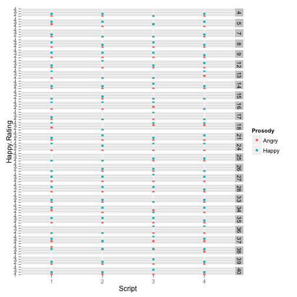

PEEP Script Ratings Analysis
========================================================

# Load data

```r
peep.df = read.csv("peep-script-ratings.csv", header = TRUE)
library(ggplot2)
library(nlme)
peep.df$Script = as.factor(peep.df$Script)
```


# Histogram of Angry, Happy Ratings by Script Prosody

```r
qplot(Angry.Rating, data = peep.df, geom = "histogram", fill = Prosody)
```

```
## stat_bin: binwidth defaulted to range/30. Use 'binwidth = x' to adjust
## this.
```

 

```r
qplot(Happy.Rating, data = peep.df, geom = "histogram", fill = Prosody)
```

```
## stat_bin: binwidth defaulted to range/30. Use 'binwidth = x' to adjust
## this.
```

 


# Details on Ratings by Script

```r
qplot(Prosody, Angry.Rating, data = peep.df, geom = "jitter", color = Script)
```

 

```r
qplot(Prosody, Happy.Rating, data = peep.df, geom = "jitter", color = Script)
```

 


# Better depiction of Ratings by Script

```r
qplot(Script, Angry.Rating, data = peep.df, geom = "jitter", color = Prosody)
```

 

```r
qplot(Script, Happy.Rating, data = peep.df, geom = "jitter", color = Prosody)
```

 


# Difference score Angry-Happy as a function of Prosody

```r
qplot(Angry.Rating - Happy.Rating, data = peep.df, geom = "density", color = Prosody)
```

 


# By Particip

```r
qplot(Script, Angry.Rating, data = peep.df, geom = "point", facets = Particip ~ 
    ., color = Prosody)
```

 

```r
qplot(Script, Happy.Rating, data = peep.df, geom = "point", facets = Particip ~ 
    ., color = Prosody)
```

 


# Mixed effects model on Angry Ratings

```r
angry.lme = lme(fixed = Angry.Rating ~ Prosody * Script, data = peep.df, random = ~1 | 
    Particip)
summary(angry.lme)
```

```
## Linear mixed-effects model fit by REML
##  Data: peep.df 
##     AIC   BIC logLik
##   473.2 506.2 -226.6
## 
## Random effects:
##  Formula: ~1 | Particip
##         (Intercept) Residual
## StdDev:      0.3316   0.6567
## 
## Fixed effects: Angry.Rating ~ Prosody * Script 
##                       Value Std.Error  DF t-value p-value
## (Intercept)           3.192    0.1443 175  22.127  0.0000
## ProsodyHappy         -1.846    0.1821 175 -10.137  0.0000
## Script2              -0.038    0.1821 175  -0.211  0.8330
## Script3              -0.192    0.1821 175  -1.056  0.2925
## Script4               0.154    0.1821 175   0.845  0.3994
## ProsodyHappy:Script2  0.269    0.2576 175   1.045  0.2973
## ProsodyHappy:Script3  0.269    0.2576 175   1.045  0.2973
## ProsodyHappy:Script4  0.077    0.2576 175   0.299  0.7656
##  Correlation: 
##                      (Intr) PrsdyH Scrpt2 Scrpt3 Scrpt4 PrH:S2 PrH:S3
## ProsodyHappy         -0.631                                          
## Script2              -0.631  0.500                                   
## Script3              -0.631  0.500  0.500                            
## Script4              -0.631  0.500  0.500  0.500                     
## ProsodyHappy:Script2  0.446 -0.707 -0.707 -0.354 -0.354              
## ProsodyHappy:Script3  0.446 -0.707 -0.354 -0.707 -0.354  0.500       
## ProsodyHappy:Script4  0.446 -0.707 -0.354 -0.354 -0.707  0.500  0.500
## 
## Standardized Within-Group Residuals:
##      Min       Q1      Med       Q3      Max 
## -3.62196 -0.56568 -0.05193  0.71121  3.64085 
## 
## Number of Observations: 208
## Number of Groups: 26
```

```r
anova(angry.lme)
```

```
##                numDF denDF F-value p-value
## (Intercept)        1   175   859.2  <.0001
## Prosody            1   175   345.4  <.0001
## Script             3   175     1.5  0.2280
## Prosody:Script     3   175     0.6  0.6389
```


# Mixed effects model on Angry Ratings

```r
happy.lme = lme(fixed = Happy.Rating ~ Prosody * Script, data = peep.df, random = ~1 | 
    Particip)
summary(happy.lme)
```

```
## Linear mixed-effects model fit by REML
##  Data: peep.df 
##     AIC BIC logLik
##   502.1 535   -241
## 
## Random effects:
##  Formula: ~1 | Particip
##         (Intercept) Residual
## StdDev:      0.4001    0.698
## 
## Fixed effects: Happy.Rating ~ Prosody * Script 
##                        Value Std.Error  DF t-value p-value
## (Intercept)           1.2692    0.1578 175   8.044  0.0000
## ProsodyHappy          1.2308    0.1936 175   6.357  0.0000
## Script2              -0.1538    0.1936 175  -0.795  0.4279
## Script3               0.0385    0.1936 175   0.199  0.8428
## Script4              -0.0769    0.1936 175  -0.397  0.6916
## ProsodyHappy:Script2 -0.0769    0.2738 175  -0.281  0.7791
## ProsodyHappy:Script3  0.0769    0.2738 175   0.281  0.7791
## ProsodyHappy:Script4  0.0000    0.2738 175   0.000  1.0000
##  Correlation: 
##                      (Intr) PrsdyH Scrpt2 Scrpt3 Scrpt4 PrH:S2 PrH:S3
## ProsodyHappy         -0.613                                          
## Script2              -0.613  0.500                                   
## Script3              -0.613  0.500  0.500                            
## Script4              -0.613  0.500  0.500  0.500                     
## ProsodyHappy:Script2  0.434 -0.707 -0.707 -0.354 -0.354              
## ProsodyHappy:Script3  0.434 -0.707 -0.354 -0.707 -0.354  0.500       
## ProsodyHappy:Script4  0.434 -0.707 -0.354 -0.354 -0.707  0.500  0.500
## 
## Standardized Within-Group Residuals:
##     Min      Q1     Med      Q3     Max 
## -2.7662 -0.4687 -0.0755  0.5111  2.7047 
## 
## Number of Observations: 208
## Number of Groups: 26
```

```r
anova(happy.lme)
```

```
##                numDF denDF F-value p-value
## (Intercept)        1   175   396.9  <.0001
## Prosody            1   175   161.7  <.0001
## Script             3   175     1.4  0.2422
## Prosody:Script     3   175     0.1  0.9569
```


# Mixed effects model on Difference

```r
diff.lme = lme(fixed = (Angry.Rating - Happy.Rating) ~ Prosody * Script, data = peep.df, 
    random = ~1 | Particip)
summary(diff.lme)
```

```
## Linear mixed-effects model fit by REML
##  Data: peep.df 
##     AIC   BIC logLik
##   677.3 710.3 -328.7
## 
## Random effects:
##  Formula: ~1 | Particip
##         (Intercept) Residual
## StdDev:      0.4689    1.109
## 
## Fixed effects: (Angry.Rating - Happy.Rating) ~ Prosody * Script 
##                        Value Std.Error  DF t-value p-value
## (Intercept)           1.9231    0.2362 175   8.142  0.0000
## ProsodyHappy         -3.0769    0.3077 175 -10.001  0.0000
## Script2               0.1154    0.3077 175   0.375  0.7081
## Script3              -0.2308    0.3077 175  -0.750  0.4542
## Script4               0.2308    0.3077 175   0.750  0.4542
## ProsodyHappy:Script2  0.3462    0.4351 175   0.796  0.4274
## ProsodyHappy:Script3  0.1923    0.4351 175   0.442  0.6590
## ProsodyHappy:Script4  0.0769    0.4351 175   0.177  0.8599
##  Correlation: 
##                      (Intr) PrsdyH Scrpt2 Scrpt3 Scrpt4 PrH:S2 PrH:S3
## ProsodyHappy         -0.651                                          
## Script2              -0.651  0.500                                   
## Script3              -0.651  0.500  0.500                            
## Script4              -0.651  0.500  0.500  0.500                     
## ProsodyHappy:Script2  0.461 -0.707 -0.707 -0.354 -0.354              
## ProsodyHappy:Script3  0.461 -0.707 -0.354 -0.707 -0.354  0.500       
## ProsodyHappy:Script4  0.461 -0.707 -0.354 -0.354 -0.707  0.500  0.500
## 
## Standardized Within-Group Residuals:
##      Min       Q1      Med       Q3      Max 
## -2.27820 -0.57062  0.09472  0.64823  2.99192 
## 
## Number of Observations: 208
## Number of Groups: 26
```

```r
anova(diff.lme)
```

```
##                numDF denDF F-value p-value
## (Intercept)        1   175    16.7  0.0001
## Prosody            1   175   361.1  <.0001
## Script             3   175     1.8  0.1456
## Prosody:Script     3   175     0.2  0.8686
```

